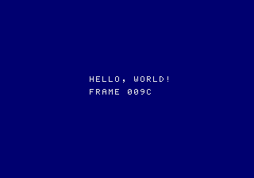

# Hello world on the Mega Drive

This chapter builds the smallest useful Mega Drive program: a 128 KB cartridge that sets up the VDP, loads a font and a palette, prints `HELLO, WORLD!`, and counts frames with the vertical interrupt. Everything in it is written for this book. Unlike the [32X hello world](32x-hello.md), it needs no part of Sega's code, so it builds from the book's sources alone.

<span class="tag emulator">emulator</span> It runs in the libretro build of PicoDrive and in ares 148, which both show the text and a counter that goes up by one every frame [PICODRIVE; ARES]. It has not been run on a console. Neither emulator ran a TMSS boot ROM, so the `SEGA` write described below is untested.

The sources are [`hello.s`](md-hello/hello.s), [`font.inc`](md-hello/font.inc) and [`build.sh`](md-hello/build.sh). The listings below are taken from them.



## What you need

- **A 68000 assembler and linker.** The build script uses GNU binutils for the 68000 (`m68k-linux-gnu-as` and `m68k-linux-gnu-ld`); any m68k binutils will do. See [Toolchain setup](toolchain.md) for the syntax traps, chiefly that `|` starts a comment and `--register-prefix-optional` lets you write `d0` instead of `%d0`.
- **Python 3**, to write the checksum into the header.

## The vectors

The cartridge starts with the 68000's 64 vectors ([The vector table](../megadrive/m68k.md#the-vector-table-and-exceptions)):

```text
{{#include md-hello/hello.s:vectors}}
```

- **The stack** starts at `$FFFE00`, near the top of the 64 KB work RAM, and grows down.
- **Reset** jumps to `start`.
- **Vector 30** is the level 6 autovector, which the VDP's vertical interrupt uses ([The vertical interrupt](../megadrive/vdp-timing.md#the-vertical-interrupt)).
- **Every other vector** goes to `crash`, which turns the screen red and stops. A program that fills every entry tells you that something went wrong, instead of running into whatever the table happened to hold.

## The header

```text
{{#include md-hello/hello.s:header}}
```

Each field is described in [Mega Drive ROM header and checksum](md-header.md). Text fields are padded with spaces, the ROM end address is the file size minus one, and the checksum is left at 0 for the build script to fill in.

## Start-up

A Mega Drive program begins in a state it cannot trust: the VDP's registers and memories hold whatever they held at power-on, and on later consoles the VDP is locked. The first instructions:

```text
{{#include md-hello/hello.s:start}}
```

1. **Mask interrupts.** The 68000 starts with them masked after reset, but code that can be reached another way should not rely on that.
2. **Unlock the VDP.** On a console whose version number, the low four bits of `$A10001`, is not zero, the program must write the four bytes `SEGA` to `$A14000` before using the VDP. Version 0 consoles have no such lock <span class="tag manual">manual</span> [MD-SWM, precautions for M5 software; [The version register](../megadrive/io.md#the-version-register)]. Skip this and the program may run in emulators and on early consoles, but not on later ones.
3. **Read the control port once.** The VDP remembers the first half of a two-word command until the second arrives. Reading the status register clears that state, so the register writes that follow are not taken as the second half of something left over ([The VDP remembers half a command](../megadrive/vdp.md#the-vdp-remembers-half-a-command)).
4. **Set 19 registers**, with the display still off:

```text
{{#include md-hello/hello.s:regs}}
```

The VRAM layout is the one most games use: tiles from `$0000`, plane A at `$C000`, plane B at `$E000`, the sprite table at `$D800` and the horizontal scroll table at `$DC00` ([What lives where in VRAM](../megadrive/vdp.md#what-lives-where-in-vram)). Register 12 selects the 320-pixel mode, register 15 the auto-increment of 2 that every loop below relies on, and register 16 planes of 64 × 32 cells. Register 1 leaves the display off for now, but has bit 2 set, which keeps the VDP in Mega Drive mode ([Registers 0 and 1](../megadrive/vdp-registers.md#registers-0-and-1-mode-set-1-and-2)).

## Clearing the VDP and silencing the PSG

```text
{{#include md-hello/hello.s:clear}}
```

Each memory is cleared with one write command followed by a loop of zero words: all 32,768 words of VRAM, the 64 colours of CRAM and the 40 words of VSRAM. Aerobiz Supersonic clears them with the same counts [AB-DISASM, VDP_Init1.asm]. With the display off every line is blank, so the CPU can write as fast as it likes ([When the CPU can get in](../megadrive/vdp.md#when-the-cpu-can-get-in)). A VRAM fill by DMA would be faster, but needs the DMA set-up in [DMA](../megadrive/vdp-dma.md#vram-fill); for a one-time clear the loop is simpler.

The four PSG bytes set every channel's attenuation to 15, which is off. Sega's own start-up code does the same; four writes rule out a stray tone from whatever the PSG held at power-on ([Silencing it](../megadrive/psg.md#silencing-it)).

The Z80 is left alone. It is held in reset at power-on, so it runs nothing until a program loads code for it ([Loading a program](../megadrive/z80.md#loading-a-program)).

## A palette and a font

```text
{{#include md-hello/hello.s:font}}
```

```text
{{#include md-hello/text.inc:load_font}}
```

**The palette** needs two colours. CRAM word 0 is the backdrop, which register 7 selects; word 1 is the text. A Mega Drive colour holds 3 bits each of blue, green and red, at bits 11-9, 7-5 and 3-1: `$0600` is a dark blue and `$0EEE` white ([Colour RAM](../megadrive/vdp-color.md#colour-ram)).

**The font** is stored at 1 bit per pixel, eight bytes per character, in [`font.inc`](md-hello/font.inc). The loader and the printing routines below are in [`text.inc`](md-hello/text.inc), which the [pipeline test](../sh2/pipeline.md#a-console-test) uses too. Its 27 characters cover only what this program and the pipeline test print. Tiles are 4 bits per pixel, so the loader expands each byte into a longword: for each of the eight bits, shift the result left by four and add 1 if the bit is set. One longword is one row of a tile, and eight rows make the 32-byte tile ([Tiles](../megadrive/vdp-planes.md#tiles)). Character *n* becomes tile *n*, so the space, character 0, is tile 0, and the cleared name table already shows spaces everywhere.

Expanding at load time keeps the font at a quarter of its size in ROM. Aerobiz Supersonic does the same with a different trick: a mask register holding a single 1 nibble is rotated four bits per pixel and ORed in where a bit is set. After eight pixels the mask is back where it started, so it never has to be reloaded [AB-DISASM, EarlyInit.asm at `$003C4A`].

## Printing

```text
{{#include md-hello/text.inc:helpers}}
```

`set_cursor` turns a column and a row into a VRAM write command for plane A. A name table row is 64 cells of two bytes, so the address is `$C000` + 2 × (64 × row + column). The command splits that address in two: bits 13-0 go in the first word, after the code bits that say "VRAM write", and bits 15-14 go at the bottom of the second word ([Two kinds of control word](../megadrive/vdp.md#two-kinds-of-control-word)).

`print` then writes one name table entry per character. With the top bits of each entry clear, the tile uses palette 0, is not flipped and has low priority, so the entry is simply the tile number ([Name table entries](../megadrive/vdp-planes.md#name-table-entries)). Because auto-increment is 2, each write moves one cell to the right. The program finds a character's tile by searching the font's character list; a real program would use a table indexed by character code.

## Counting frames

```text
{{#include md-hello/hello.s:print}}
```

With both lines printed, the program turns the display on and enables the vertical interrupt in one write to register 1, then lowers the 68000's interrupt mask to 5 so that level 6 gets through.

```text
{{#include md-hello/hello.s:loop}}
```

The interrupt handler only adds one to a counter in work RAM. The main loop waits for the counter to change, which happens at the start of each vertical blank, and then writes the four hex digits of the count with `put_hex`, from the printing routines above. Its VRAM writes therefore land early in vertical blank, when the CPU has the VDP's full bandwidth ([Organising the frame](../megadrive/vdp-timing.md#organising-the-frame)). `put_hex` needs no search: `0` to `9` are glyphs 3 to 12, and `A` to `F` follow at 13 to 18.

Keeping the handler this small is the usual pattern. The interrupt marks time, and the main program decides what to do with it.

## Building

```sh
{{#include md-hello/build.sh}}
```

The checksum is the 16-bit sum of every word from `$200` to the end of the ROM ([The checksum](md-header.md#the-checksum)). The script assembles and links first, then adds up the words and writes the sum at `$18E`. A plain Mega Drive does not check it; checking is up to the game, and tools and emulators often warn when it is wrong ([Who checks it](md-header.md#who-checks-it)).

## Running it

- **PicoDrive** (libretro build): frames captured headless at 100, 130 and 160 show the two lines, with the counter at `$009C` at frame 160. The vertical interrupt is therefore running from about the fourth frame after power-on <span class="tag emulator">emulator</span> [PICODRIVE]. [Testing in emulators](emulator-testing.md) describes the capture.
- **ares 148**: the same picture, at 60 frames per second <span class="tag emulator">emulator</span> [ARES].

## What this leaves out

- **Controllers.** Reading a pad needs the I/O port set-up in [Controllers and I/O ports](../megadrive/io.md#how-a-pad-read-works), and the Z80 bus held during the read.
- **Sound.** The Z80 stays in reset and the PSG silent. See [The Z80 and sound](../megadrive/sound.md).
- **DMA.** Every transfer here is a CPU loop. Uploading more than a few tiles per frame needs [DMA](../megadrive/vdp-dma.md).
- **Sprites.** The sprite table is cleared but unused. See [Sprites](../megadrive/vdp-sprites.md).
- **PAL.** The program never reads the version register's PAL bit; it runs at 50 frames per second on a PAL console, and its counter counts at that rate.
- **Sega's initial program.** Licensed games had to start with Sega's standard start-up code. This program does its essential steps (the TMSS write, the VDP set-up, the PSG silence) in its own way; see [The code at `$200`](md-header.md#the-code-at-200).

## What to take away

- Fill every vector, and point the ones you do not expect at something visible.
- Unlock the VDP with `SEGA` at `$A14000` on consoles with a non-zero version, then read the control port once before writing registers.
- Set registers and clear VRAM, CRAM and VSRAM with the display off.
- Store fonts at 1 bit per pixel and expand them while loading.
- A VRAM write command splits the address: bits 13-0 in the first word, bits 15-14 in the second.
- Keep the vertical interrupt handler small, and do the VDP work in the main loop just after it.

## Sources

- [MD-SWM](../appendices/bibliography.md#md-swm): precautions for M5 software (TMSS); version register
- [AB-DISASM](../appendices/bibliography.md#ab-disasm): VDP_Init1.asm; EarlyInit.asm at `$003C4A`
- [PICODRIVE](../appendices/bibliography.md#picodrive): libretro build, headless frontend
- [ARES](../appendices/bibliography.md#ares): version 148
